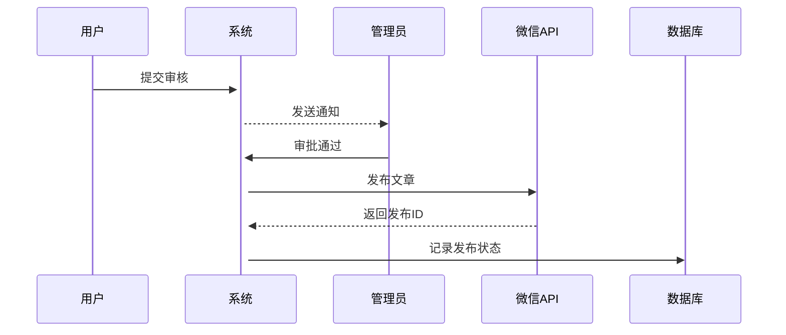

# 视频内容自动化处理系统开发文档
## 1. 项目概述
### 1.1 核心目标
- 实现视频内容到公众号文章的端到端自动化处理
- 支持多风格内容生成与人工审核流程
- 构建可扩展的媒体处理流水线

### 1.2 系统架构图
```
[视频输入] → [脚本提取] → [内容总结] → [文章生成] → [审核系统] → [发布模块]
    ▲           ▲              ▲             ▲
    │           │              │             │
[配置中心]←[异常处理]←[日志监控]←[版本控制]
```

## 2. 技术栈选型
| 模块           | 技术方案                          | 版本要求   |
|----------------|-----------------------------------|------------|
| 语音转文本     | OpenAI Whisper                    | >= v3      |
| 文本处理       | Ollama + LangChain                | 0.1.25+    |
| 文章生成       | Jinja2模板引擎 + 自定义样式引擎   | 3.x        |
| 流程编排       | Celery + Redis                    | 5.3+       |
| 发布接口       | 微信公众号API + Requests          | -          |
| 数据持久化     | SQLite + Alembic迁移工具          | 3.40+      |
| 配置管理       | Python-Decouple + YAML            | 3.8+       |

## 3. 核心功能实现
### 3.1 视频处理模块
#### 实现步骤：
1. 使用FFmpeg进行视频预处理（格式转换/分段处理）
2. 调用Whisper API获取初始字幕
3. 生成带时间戳的SRT文件及纯文本文件

#### 异常处理:
1. 静音片段超过30秒 → 触发人工检查
2. 识别置信度<60% → 标注待校对

```python
class VideoProcessor:
    def __init__(self, config):
        self.whisper_model = load_whisper_model(config.model_path)
        
    def process(self, video_path):
        # 实现视频分段处理逻辑
        segments = self._split_video(video_path)
        return [self._transcribe(segment) for segment in segments]
```

### 3.2 文本总结模块
#### 关键技术点：
- 设计多层级提示词模板体系
- 实现上下文感知的总结策略
- 支持自定义总结风格参数

#### 质量保障:
- 自动检测关键信息保留率（≥85%）
- 重复内容过滤机制

```yaml
# 提示词模板示例（templates/summary.yaml）
学术风格:
  系统提示: |
    你是一位学术内容编辑，请用严谨的学术语言总结以下内容：
    要求：
    1. 保留专业术语
    2. 分点陈述核心论点
    3. 字数控制在300字以内
```

### 3.3 文章生成引擎
#### 样式控制方案：
1. 使用Markdown作为中间格式
2. 开发模板继承系统支持样式复用
3. 实现动态组件插入机制（二维码/头图等）

#### 格式规范:
1. 最终生成微信富文本格式
2. 标题层级: 不超过三级
3. 段落长度: ≤500字符
4. 图片比例: 16:9（封面图）

```jinja2
{# 文章模板示例 #}



## {{ summary.title }}

{{ summary.content|indent(4) }}



```

## 4. 审核发布系统
### 4.1 审核流程设计
1. 生成审核用预览页面
2. 实现多级审批工作流
3. 开发版本对比功能

### 4.2 自动发布模块


## 5. 配置与扩展
### 5.1 配置文件结构
```python
# config/settings.yaml
models:
  whisper:
    model_size: medium
    device: cuda
  
  ollama:
    base_url: http://localhost:11434
    timeout: 300

wechat:
  appid: WX_APP_ID
  secret: WX_APP_SECRET
```

### 5.2 扩展点设计
1. 支持替换其他语音识别引擎
2. 可插拔的模板渲染引擎
3. 自定义回调钩子机制

## 6. 开发规范
### 6.1 代码管理
- 采用Git Flow分支策略
- 模块化开发规范
- 接口定义先行原则

### 6.2 测试方案
| 测试类型       | 覆盖率要求 | 工具链          |
|----------------|------------|-----------------|
| 单元测试       | ≥80%       | pytest          |
| 集成测试       | 关键路径   | behave          |
| 性能测试       | 峰值处理   | locust          |

## 7. 部署方案
### 7.1 环境要求
- NVIDIA GPU（推荐RTX 3090+）
- CUDA 11.7+
- Docker 20.10+

### 7.2 容器化部署
```dockerfile
FROM nvidia/cuda:11.7.1-base

RUN apt-get update && apt-get install -y ffmpeg python3.9

COPY requirements.txt .
RUN pip install -r requirements.txt

ENTRYPOINT ["celery", "-A", "main", "worker", "--loglevel=info"]
```

## 8. 项目路线图
| 阶段   | 里程碑                      | 交付物                      |
|--------|-----------------------------|----------------------------|
| Phase1 | 基础流水线搭建              | 可运行的原型系统            |
| Phase2 | 多风格支持                  | 样式模板库（≥5种）          |
| Phase3 | 审核系统完善                | 完整管理后台                |
| Phase4 | 性能优化                    | 自动化基准测试报告          |

## 附录
### A. 典型代码示例
### B. 异常处理手册
### C. API文档索引
---

### 文档特点说明：
1. **模块化设计**：每个功能模块独立成章，支持并行开发
2. **渐进式披露**：通过技术方案->实现步骤->代码示例的三层结构
3. **可维护性**：包含明确的扩展点设计和配置规范
4. **团队协作**：整合开发规范与测试要求
5. **风险控制**：通过容器化方案保证环境一致性

建议配合以下工具提升协作效率：
1. Swagger UI - 用于接口文档维护
2. Jupyter Notebook - 用于算法模块验证
3. Prometheus - 用于系统监控

此文档框架可根据实际开发进度采用增量更新策略，建议每周维护版本变更日志。